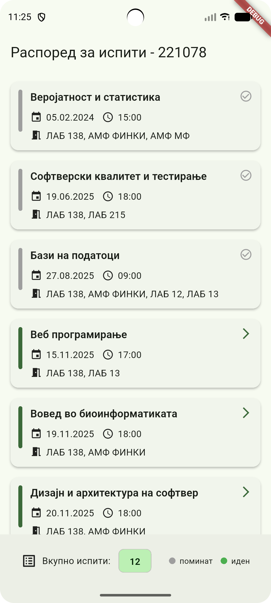
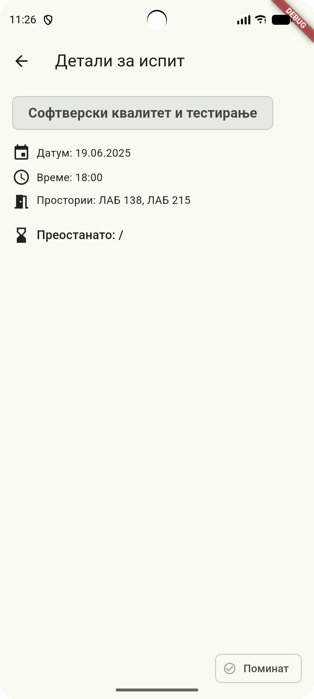
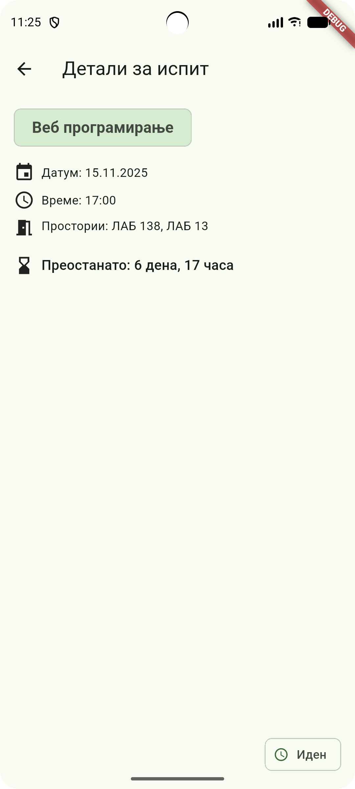

# 📚 Exam Schedule App (MIS - Лабораториска вежба 1)

Flutter мобилна апликација за приказ на распоред на испити.
Оваа апликација е изработена за потребите на предметот **Мобилни Информатички Системи (MIS)**.

---

## ✅ Функционалности
- Почетен екран со листа на испити
- Хронолошки подредени
- Различни бои за поминати и идни испити
- Детален екран за секој испит
- Преглед колку време останува до испитот
- Статус (поминат/иден)
- Bottom bar со бројач и легенда
- Fade transition при отворање детали

---

## ✅ Технологии
- Flutter 3.x
- Dart
- Material Design 3
- intl пакет за формат на датуми

---

## ✅ Како да стартувате

1. Клонирајте го проектот:
```bash
git clone <URL-DO-REPO>
```

2. Влезете во проектот:
```bash
cd exam_schedule_app
```

3. Инсталирајте ги пакетите:
```bash
flutter pub get
```

4. Стартувајте Android емулатор (Android Studio → Device Manager)

5. Пуштете ја апликацијата:
```bash
flutter run
```


---

## ✅ Скриншоти


```
screenshots/Screenshot_home_screen.png
screenshots/Screenshot_details_screen_exceeded.png
screenshots/Screenshot_details_screen_upcoming.png
```

И вметнете ги тука:




---

## ✅ Видео (демо)


```
video/Screen_recording.webm
```

И додадете го во README:

[🎬 Гледај демо](video/Screen_recording.webm)

---

## ✅ Автор

**Верица Чочоровска**  
ФИНКИ – УКИМ  
Индекс: **221078**
